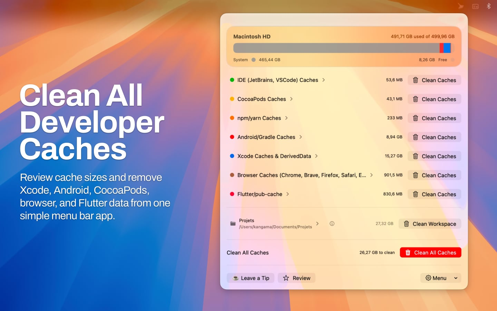

<p align="center">
  
</p>

<h1 align="center">DevCacheCleaner</h1>

<p align="center">
  A macOS menu bar app for inspecting and cleaning developer caches stored in your Home folder and selected workspaces.
</p>

<p align="center">
  DevCacheCleaner scans common cache-heavy directories, shows how much disk space they use, and lets you clean one category, all supported categories, or generated workspace folders with live progress feedback.
</p>


<p align="center">
  You can download the app from the Mac App Store.
</p>

<p align="center">
  <a href="https://apps.apple.com/app/clean-caches-devcachecleaner/id6761360208">
    
  </a>
</p>

---

<p align="center">
  
</p>

If you want to reclaim storage used by Xcode, Gradle, CocoaPods, npm, Yarn, Bun, browsers, design apps, project dependencies, and other development tools without manually digging through `~/Library`, hidden folders, and workspace build outputs, this project is built for that workflow.

DevCacheCleaner keeps the scope intentionally focused:

- It only scans paths defined in the app configuration
- It works inside the user Home directory
- It asks for explicit Home-folder access before reading or deleting anything
- It shows cleanup progress while files are being removed

## Features

- Menu bar utility built with SwiftUI
- Security-scoped access to the user Home directory
- Per-category storage overview
- Single-category cleanup
- Clean-all workflow across all non-empty categories
- Workspace selection with persisted access
- Workspace cleanup for generated dependency and build folders
- Optional Clean All checkbox to include the selected workspace
- Workspace details view showing the generated folders that can be cleaned
- Cleanup progress window with live deletion feedback
- Automatic refresh when watched cache folders change

## How It Works

1. The app requests access to your Home folder and stores a security-scoped bookmark.
2. Storage categories are built from configured paths in [`Constants.swift`](./DevCacheCleaner/Common/Utils/Constants.swift).
3. Each category is scanned and displayed in the main menu bar window.
4. Folder changes are monitored so affected categories can refresh automatically.
5. You can optionally select a workspace folder. The app scans it for supported generated directories such as `node_modules`, `Pods`, `.build`, `.gradle`, and `build`.
6. Cleanup runs for one category, all non-empty Home-folder categories, the selected workspace, or Clean All plus the selected workspace when the confirmation checkbox is enabled.
7. Cleanup progress is reported in a separate window.

## Run In Xcode

1. Open `DevCacheCleaner.xcodeproj`
2. Select the `DevCacheCleaner` scheme
3. Run the app

The app launches from the macOS menu bar and opens a secondary window during cleanup to display progress.


## Architecture

The project follows a simple layered structure:

- `Common`: shared constants, managers, utilities, extensions, dependency container
- `Data`: repository implementations
- `Domain`: entities, repository protocols, and use cases
- `Presentation`: SwiftUI views, view models, and shared UI state
- `DevCacheCleanerTests`: use case, mock, and view model tests

Main behavior is driven by focused domain use cases such as:

- `LoadStorageOverviewUseCase`
- `RefreshStorageCategoryUseCase`
- `CleanStorageCategoryUseCase`
- `CleanAllStorageCategoriesUseCase`
- `LoadWorkspaceCleanupCategoryUseCase`
- `ReadDiskSpaceUseCase`
- `ObserveDiskChangesUseCase`
- `SaveWorkspaceAccessUseCase`
- `ResolveWorkspaceAccessUseCase`

## Project Structure

```text
DevCacheCleaner/
├── DevCacheCleanerApp.swift            # Menu bar app entry and window scenes
├── Assets.xcassets/                    # App icon and in-app artwork
├── Common/
│   ├── Extensions/                     # Shared helpers for URL, storage sizes, collections, colors
│   ├── Managers/                       # File-system, monitoring, and Home-access integrations
│   └── Utils/                          # Constants, alerts, parameters, shared utilities
├── Data/
│   └── Repositories/                   # Repository implementations
├── Domain/
│   ├── Entities/                       # Storage models and cleanup progress events
│   ├── Repositories/                   # Repository protocols
│   └── UseCases/
│       ├── Cleanup/                    # Clean one category or all categories
│       ├── HomeAccess/                 # Security-scoped Home-folder access
│       ├── Monitoring/                 # Folder change observation
│       └── Storage/                    # Build, load, refresh, and read storage data
├── Presentation/
│   ├── Stores/                         # Shared progress state for the cleanup window
│   ├── Views/                          # Reusable SwiftUI views
│   └── ...                             # Home/progress views and view models
└── DevCacheCleanerTests/
    ├── UseCase/                        # Domain use case tests
    ├── ViewModel/                      # Presentation view model tests
    ├── mock/                           # Repository mocks
    └── Utils/                          # Shared test fixtures and async helpers
```

## Default Cache Categories

DevCacheCleaner ships with built-in cleanup categories defined in
[`Constants.swift`](./DevCacheCleaner/Common/Utils/Constants.swift). Each one
groups a set of cache paths inside the user Home directory and is scanned,
displayed, and cleaned as a single category in the app.

| Category | Typical Targets | Example Paths |
| --- | --- | --- |
| IDE Caches | VS Code cache data and workspace storage | `~/Library/Application Support/Code/Cache`, `~/Library/Application Support/Code/CachedData`, `~/Library/Application Support/Code/User/workspaceStorage` |
| CocoaPods Caches | CocoaPods specs repos and cache folders | `~/.cocoapods/repos`, `~/Library/Caches/CocoaPods` |
| npm, Yarn, and Bun Caches | Node package manager caches | `~/.npm-cache-user/_cacache`, `~/Library/Caches/Yarn`, `~/.bun/install/cache` |
| Android and Gradle Caches | Gradle caches, daemon data, Android Studio cache roots | `~/.gradle/caches`, `~/.gradle/daemon`, `~/Library/Caches/Google`, `~/Library/Caches/JetBrains` |
| Xcode Caches and DerivedData | DerivedData, Archives, simulator data, Xcode caches | `~/Library/Developer/Xcode/DerivedData`, `~/Library/Developer/Xcode/Archives`, `~/Library/Developer/CoreSimulator/Devices` |
| Browser Caches | Chrome, Brave, Firefox, Safari, Edge, and Opera caches | `~/Library/Caches/Google/Chrome`, `~/Library/Caches/BraveSoftware/Brave-Browser`, `~/Library/Caches/com.apple.Safari` |
| Flutter and pub-cache | Flutter and Dart package cache data | `~/.pub-cache` |
| Design App Caches | Figma, Adobe, and Apple Motion cache data | `~/Library/Application Support/Figma`, `~/Library/Application Support/Adobe/Common`, `~/Library/Containers/Motion/Data/Library/Caches/com.apple.motionapp/Retiming Cache Files` |

Some built-in categories use prefix-based matching. For example, the
Android/Gradle category only targets `AndroidStudio*` directories inside
certain JetBrains and Google cache roots.

## Workspace Cleanup

Workspace cleanup is separate from the Home-folder cache categories. After a
workspace is selected, DevCacheCleaner scans the project tree for known marker
files and only offers cleanup for generated directories that match those rules.

| Project Type | Marker Files | Generated Directory |
| --- | --- | --- |
| Node.js | `package.json` | `node_modules` |
| CocoaPods | `Podfile` | `Pods` |
| Swift Package Manager | `Package.swift` | `.build` |
| Android Gradle root | `settings.gradle`, `settings.gradle.kts` | `.gradle` |
| Android module build output | `build.gradle`, `build.gradle.kts` | `build` |

The selected workspace can be cleaned directly from the workspace row. It can
also be included in the Clean All flow by checking the workspace option in the
confirmation alert. When this option is checked, the progress total includes
both the Home-folder cache categories and the selected workspace cleanup size.

Workspace cleanup is intended for generated dependency and build folders only.
Source files, project files, and marker files are not part of the cleanup
targets.

## Roadmap

- Add a Settings screen
- Make the minimum cleanup size threshold configurable
- Allow users to enable or disable built-in cache categories
- Allow users to manage ignored workspace paths
- Add configurable workspace cleanup rules
- Add a preview step before deleting files
- Improve progress labels for combined Clean All and workspace cleanup

## Notes

- The app only cleans paths explicitly listed in `Constants`
- Some configured paths use prefix matching so only specific child directories are removed
- Workspace cleanup only targets generated directories matched by `WorkspaceCleanupRuleEntity`
- Clean All includes the selected workspace only when the confirmation checkbox is checked
- Cleanup deletes cache contents and cannot be undone
- Backing up anything important before cleaning is still the safer choice

## License

The source code in this repository is licensed under `GPL-3.0-only`. See
[`LICENSE`](./LICENSE).

The project name, logos, icon assets, and official branding are not granted
under the GPL code license. See [`TRADEMARKS.md`](./TRADEMARKS.md).

Official Mac App Store releases are published by Karim Angama.

---

## 🧑‍💻 Author

**k.angama**  
[GitHub](https://github.com/k-angama) • [LinkedIn](https://www.linkedin.com/in/karim-angama)
